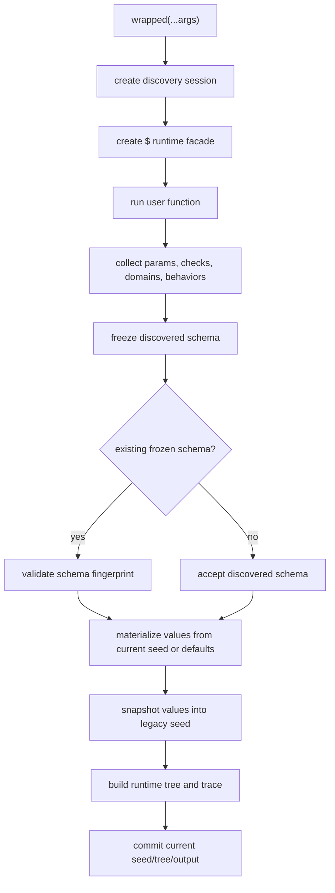

# Cultivar JS Research Brief

วันที่จัดทำ: 2026-05-20

ไฟล์นี้รวบรวมข้อมูลเรื่อง design และความสามารถของ `cultivar-js` จากโค้ดและเอกสารใน repo เพื่อใช้เป็นฐานสำหรับงานวิจัยเกี่ยวกับ seed, reproducibility, tuning, search, hierarchical workflows หรือหัวข้ออื่นที่เกี่ยวข้อง โดยตั้งใจทำให้เป็นไฟล์เดียวที่อ่านต่อได้โดยไม่ต้องเปิดหลายเอกสารพร้อมกัน

## 1. Executive Summary

`cultivar-js` เป็น TypeScript/Node.js library ที่แปลง function ธรรมดาให้เป็น function ที่มี seed ควบคุม parameter ภายในได้ เรียกซ้ำได้แบบ deterministic, save/load ได้, tune ได้, และประกอบเป็น hierarchy ของ child domains ได้

แก่นของระบบคือ wrapper `seed(fn, meta?)` ที่ส่ง object/function ชื่อ `$` เข้าไปใน function ของผู้ใช้ ผู้ใช้ประกาศ parameter ด้วย `$("name", spec)` ภายใน function เดิม ระบบจะค้นพบ schema จากการรันครั้งแรก freeze schema นั้น และสร้าง seed ที่ผูกกับ schema, stable id, version, parameter fields, relations, checks, child domains, behaviors และ domain relations

จุดเด่นเชิง design:

- Wrapper-first API: ผู้ใช้ยังเขียน function shape เดิม เพียงเพิ่ม `$` เป็น argument แรก
- Inline schema discovery: schema เกิดจาก declaration ภายใน runtime function ไม่ต้องเขียน schema แยก
- Stable persistence boundary: stable wrapper ต้องมี `id` และ `version`; ephemeral wrapper ใช้ทดลองได้แต่ save/load แบบ stable ไม่ได้
- Deterministic tuning: tuning session และ candidate seed derivation ใช้ canonical hashing เพื่อให้ replay ได้
- Hierarchical seed tree: parent function เรียก child seeded functions ได้โดยไม่ mutate current seed ของ child wrapper เอง
- Experience layer: เก็บประสบการณ์ candidate selection เป็น JSONL และ derive habits เพื่อ bias candidate รุ่นหลัง
- Seed bank: เก็บ seed ที่ดีหรือเคยถูกเลือก เพื่อ reuse, warm-start child domains, หรือเป็น donor สำหรับ hierarchical mutation

## 2. Package And Runtime Surface

ข้อมูล package ปัจจุบันจาก `package.json`:

- Package name: `cultivar-js`
- Version ใน repo: `0.1.8`
- Runtime หลัก: Node.js `>=18`
- Package format: ESM, CommonJS, TypeScript declarations
- Public exports:
  - `cultivar-js`
  - `cultivar-js/errors`
- Runtime package ไม่มี dependency ภายนอกใน `dependencies`; มี dev dependencies เช่น TypeScript, Bun types, Node types
- Published files ตั้งใจจำกัดไว้ที่ `dist`, docs, `CHANGELOG.md`, `DOCUMENTATION.md`, `README.md`

Non-goals ที่ระบุใน roadmap:

- ยังไม่รองรับ browser runtime โดยตรงถ้าไม่มี Node built-in polyfills
- ไม่ถือ `dist/internal/*` เป็น public API
- ยังไม่เปลี่ยน CLI เป็น full-screen terminal UI
- ไม่เปลี่ยน binary wire format โดยไม่มีแผน compatibility

## 3. Core Mental Model

### 3.1 Function Wrapper

รูปแบบพื้นฐาน:

```ts
import { seed } from "cultivar-js";

const wrapped = seed(
  async ($, input: string) => {
    const value = $("value", {
      type: "f64",
      range: [0, 1],
      default: 0.5,
    });

    return `${input}:${value}`;
  },
  { id: "example.wrapper", version: "1" },
);
```

สิ่งที่เกิดขึ้น:

1. `seed(fn, meta?)` สร้าง callable wrapper
2. เมื่อ wrapper ถูกเรียก ระบบสร้าง discovery session
3. `$()` register parameter และคืนค่าปัจจุบันของ seed
4. `$.rel()`, `$.check()`, `$.domain()`, `$.behavior()`, `$.domainRel()` register metadata เพิ่มเติม
5. หลัง function จบ ระบบ freeze schema
6. ถ้าเคยมี schema แล้ว ระบบเช็ค schema fingerprint เพื่อกัน drift
7. ระบบสร้างหรือ reuse current seed
8. Direct calls ถัดไป reuse current seed จนกว่าจะ reset, load, import หรือ tune

### 3.2 Stable Versus Ephemeral Wrapper

Stable wrapper:

```ts
seed(fn, { id: "image.render", version: "1" });
```

รองรับ:

- `save`, `load`
- `exportBytes`, `importBytes`
- `saveTree`, `loadTree`
- `exportTree`, `importTree`
- `subSeed`, `setSubSeed`, `listSubSeeds`
- stable schema compatibility check

Ephemeral wrapper:

```ts
seed(fn);
```

รองรับ:

- direct execution
- tuning ระหว่าง runtime

ไม่รองรับ:

- stable file/byte persistence
- tree persistence แบบ stable

เหตุผลเชิง design: การ replay seed ต้องมี identity ที่ stable ข้าม process/session ได้ จึงต้องมี `id` และ `version`

## 4. Public API Capability Matrix

| Capability | Public API | บทบาท |
| --- | --- | --- |
| Create seed-aware wrapper | `seed(fn, meta?)` | ครอบ function ให้มี current seed และ tuning methods |
| Declare seeded parameter | `$("name", spec)` | ประกาศ parameter ที่ seed ควบคุม |
| Parameter relation | `$.rel(source, target, spec)` | บันทึก relation ระหว่าง parameters เพื่อ guide schema identity และ mutation |
| Runtime validation | `$.check(name, predicate, spec)` | reject หรือ warn candidate ที่ผิดเงื่อนไข |
| Child domain | `$.domain(name, subFn, args, options)` | เรียก child seeded function แบบ tree-aware |
| Child domain list | `$.domainList(name, items, keyFn, subFn, argsFn, options)` | เรียก child domain หลายรายการโดยใช้ key stable |
| Behavior reporting | `$.behavior(name, value)` | ให้ child/parent รายงาน numeric behavior เพื่อ reuse, constraints, trace |
| Domain relation | `$.domainRel(source, target, spec)` | บันทึก cross-domain relation เช่น child กับ behavior หรือ domain อื่น |
| Auto/human/custom tuning | `wrapped.tune(...)` | mutate, evaluate, select, commit winner |
| CLI tuning | `wrapped.tuneCli(...)` | interactive line-oriented tuner |
| Flat persistence | `save`, `load`, `exportBytes`, `importBytes` | เก็บและ replay root seed |
| Tree persistence | `saveTree`, `loadTree`, `exportTree`, `importTree` | เก็บ root plus child seed tree |
| Sub-seed operations | `subSeed`, `setSubSeed`, `listSubSeeds` | inspect/export/inject child seeds |
| Introspection | `schema()`, `schema({ internal: true })` | ดู schema, internal ids, fingerprints |
| Current seed handle | `wrapped.seed` | ดู values/meta/export ของ current seed |
| Typed errors | `cultivar-js/errors` | error classes สำหรับ schema, seed, validation, selection, timeout |

## 5. Parameter And Schema Design

### 5.1 Supported Seed Scalar Types

`ParamSpec` รองรับ type:

- `f64`
- `f32`
- `u64`
- `u32`
- `u16`
- `u8`
- `bool`
- `string`
- `bytes`

ค่า parameter เป็น scalar เท่านั้นใน wrapper-facing API แม้ legacy internal seed format จะรู้จัก array/composite ในบางจุด

### 5.2 Parameter Spec

```ts
interface ParamSpec<T> {
  type: SeedTypeName;
  range?: [number, number];
  default?: T;
  tier?: "core" | "texture";
}
```

ความหมาย:

- `type`: ชนิดข้อมูลใน seed
- `range`: ขอบเขต numeric mutation และ default materialization
- `default`: ค่าเริ่มต้นก่อน mutation
- `tier`: แยกความสำคัญของ parameter
  - `core`: structural parameter
  - `texture`: detail parameter ที่ mutation explore ได้อิสระกว่า

ถ้าไม่มี default:

- `bool` เป็น `false`
- `string` เป็น `""`
- `bytes` เป็น `Uint8Array()` ว่าง
- `u64` ใช้ lower bound หรือ `0n`
- numeric อื่นใช้ midpoint ของ range หรือ `0`

### 5.3 Schema Discovery

ระบบค้นพบ schema จากการรัน function:

- parameter declarations
- relations
- checks
- domain slots
- behaviors
- domain relations

จากนั้น freeze เป็น `SchemaSnapshot`

Schema fingerprint คำนวณจาก canonical representation ของ:

- `meta.version`
- params: name, tier, spec
- relations
- checks
- domain slots and child schema fingerprints
- behaviors
- domain relations

การเรียง declaration order ไม่ควรทำให้ fingerprint เปลี่ยน เพราะระบบ sort declarations ก่อน hash

### 5.4 Schema Drift

ถ้า stable wrapper เคย freeze schema แล้วมีการประกาศ schema ต่างไปโดยไม่ได้ bump `meta.version` ระบบ throw `SchemaDriftError`

ต้อง bump version เมื่อเปลี่ยน:

- parameter name/type/range/default/tier
- relation/check
- domain slot
- child domain schema
- behavior
- domain relation

ข้อสังเกตสำหรับ research: schema version เป็น compatibility boundary ของ function declaration ไม่ใช่ binary wire version

## 6. Identity And Determinism Design

### 6.1 Domain UUID

Stable id ถูก derive เป็น deterministic UUIDv8 ด้วย SHA-256 namespace:

- current domain UUID ใช้ `domainUuidFromStableId(stableId)`
- legacy UUID ยังยอมรับได้ผ่าน `acceptedDomainUuidsFromStableId(stableId)`

หมายเหตุจากโค้ด: UUID derivation เป็น identity plumbing ไม่ใช่ security boundary

### 6.2 Hidden Field IDs

Parameter field IDs และ relation IDs derive จาก:

- stable id หรือ runtime id
- schema version
- tier
- name

ใช้ CRC32 allocate เข้า range ของ core, texture, bond fields โดยกัน collision ใน factory เดียวกัน

ผลเชิง design:

- field IDs stable สำหรับ stable id/version/name เดิม
- binary seed ไม่ต้องเก็บชื่อ parameter โดยตรง
- schema เป็นตัว map field ID กลับเป็น parameter name

### 6.3 Canonical Fingerprints

ระบบใช้ canonical serialization ที่:

- sort object keys
- encode `bigint`, `Uint8Array`, `Date`, `undefined`, `NaN`, `Infinity` แบบ explicit
- hash ด้วย SHA-256

ใช้กับ:

- schema fingerprint
- output hash ใน domain trace
- task signature/input hash
- tree cache key
- tune session seed
- tree integrity hash

## 7. Seed Persistence Design

### 7.1 Flat Seed

Flat seed wire format ตาม docs:

1. header
2. core fields
3. texture fields
4. bond fields
5. SHA-256 footer

Header มี domain id, generation, entropy budget, domain schema version, CRC32 และ metadata อื่นตาม legacy seed format

Core fields และ texture fields มาจาก parameters:

- `tier: "core"` เข้า core fields
- `tier: "texture"` เข้า texture fields

Bond fields มาจาก `$.rel()`

### 7.2 Integrity

ระบบมี:

- CRC32 ใน header สำหรับตรวจ corruption เร็ว
- SHA-256 footer สำหรับตรวจ accidental corruption

ข้อจำกัดสำคัญ:

- ไม่ใช่ authenticity guarantee
- ไม่ใช่ tamper-resistance boundary
- ผู้แก้ payload ได้สามารถ recompute hash/footer ได้
- ถ้าต้องการ adversarial integrity ต้อง wrap ด้วย signature หรือ HMAC ภายนอก

### 7.3 Tree Seed Envelope

Hierarchical persistence ใช้ JSON envelope format `SDTREE/1`

ประกอบด้วย:

- root tree node
- child tree nodes
- `seedStore` เก็บ seed bytes base64 keyed by seed hash
- domain edges
- root schema fingerprint
- integrity hash ของ canonical body

Tree persistence ต้องการ stable wrapper ทุก domain ใน tree ถ้ามี ephemeral child domain จะ export tree แบบ stable ไม่ได้

### 7.4 Sub-seed Model

จาก parent tree สามารถ:

- `listSubSeeds()` ดู child paths
- `subSeed(path)` export child seed
- `setSubSeed(path, bytes)` inject child seed ที่ compatible

ระบบตรวจ:

- domain UUID match
- schema version match
- schema fingerprint match เมื่อมี schema แล้ว

## 8. Invocation Lifecycle

ภาพรวม direct invocation:



รายละเอียดที่สำคัญ:

- `$.check()` อาจเป็น async ได้ และถูก await หลัง user function run
- reject check throw `ValidationRejectedError`
- warn check เก็บ warning แต่ไม่ reject direct execution
- ใน tuning, rejected/time-out candidates ถูกนับและข้าม
- child domains ถูกเรียกด้วย `invokeSeededFunctionScoped` เพื่อไม่ mutate standalone child wrapper state
- current wrapper state ถูก commit เฉพาะ invocation หลัก หรือ selected candidate ใน tuning

## 9. Tuning Design

### 9.1 Tuning Forms

Shorthand:

```ts
await wrapped.tune(
  (output) => score,
  { args, generations, batchSize },
);
```

Full form:

```ts
await wrapped.tune({
  args,
  generations,
  batchSize,
  selector: "auto",
  score,
  objectives,
  preference,
  preview,
  lineage,
  experience,
  hierarchical,
});
```

Default behavior:

- shorthand defaults to `selector: "auto"`
- object form defaults to `selector: "human"` unless specified
- `selector: "auto"` requires `score`, or `objectives` plus `preference`

### 9.2 Candidate Generation

Tuning establishes initial schema/current seed if needed จากนั้นแต่ละ generation:

1. derive deterministic `sessionSeed`
2. derive deterministic candidate seed ต่อ generation/batchAttempt/position
3. mutate current seed หรือ hierarchical tree
4. run candidate without committing wrapper state
5. compute preview/score/objectives
6. filter rejected/time-out candidates
7. select winner
8. commit winner seed/tree/output
9. update lineage, experience, seed bank, domain credits

### 9.3 Deterministic Session Seed

Session seed derive จาก canonical hash ของ:

- mode: `tune` หรือ `cli`
- wrapper id
- version
- base seed hash
- args
- tuning options subset

Candidate seed derive จาก:

- session seed
- generation
- batch attempt
- candidate position

ผลคือ fresh wrappers ที่มี stable id/version/schema/args/options เดียวกันควรได้ tuning history และ winning seed เดียวกันในเส้นทาง deterministic เดียวกัน

### 9.4 Selection Modes

- `auto`: เลือก candidate score สูงสุด
- `human`: prompt ผู้ใช้ผ่าน `InteractiveIO` หรือ runtime `prompt()`
- custom selector: function รับ candidates และคืน position

ระบบ validate:

- empty candidates เลือกไม่ได้
- custom selector ต้องคืน integer ใน range
- auto ต้องมี score ครบทุก candidate
- select timeout ใช้ `timeouts.selectMs`

### 9.5 Scoring And Objectives

รองรับ:

- scalar `score(output, ctx)`
- multi-objective `objectives(output, ctx)`
- `preference` เป็น weight profile หรือ reducer function

Objective-only auto selection ต้องมี preference เพื่อ convert เป็น scalar score

### 9.6 Radius And Mutation

Public radius:

- `narrow`
- `medium`
- `broad`
- partial `RadiusSetting`

Internal legacy mapping:

- `narrow` maps to legacy `fine`
- `medium` maps to legacy `medium`
- `broad` maps to legacy `broad`

`RadiusSetting` fields:

- `coreMutationRate`
- `coreMutationMagnitude`
- `textureGrowthCount`
- `textureEditRate`
- `textureEditMagnitude`
- `bondGrowthCount`
- `bondEditRate`

### 9.7 Stagnation And Exploration

Tuning ใช้ `StagnationDetector` เพื่อประเมิน selected snapshots ถ้ามี recommendation เช่น broader radius หรือ exploratory restart ratio รุ่นถัดไปอาจเพิ่ม exploratory candidates

### 9.8 Lineage

Lineage record เก็บ:

- winner seed hash
- parent seed hash
- mutation operator
- radius parameters
- generation round
- batch size/rank
- curator action and tags
- execution seed/session seed/candidate seed

Lineage store เป็น in-memory หรือ JSONL file ตาม `lineage` option

## 10. CLI Tuning Design

`tuneCli()` เป็น line-oriented interactive tuner ที่ออกแบบให้:

- ใช้ใน plain terminal ได้
- automate ใน tests ได้
- embed ผ่าน injected IO hooks ได้
- compatible กับ Node package consumers

Commands หลัก:

- `pick n` หรือ `[n]`: เลือก candidate แล้วไปต่อ
- `done`, `done n`: จบ tuning
- `inspect n` หรือ `view n`: ดู values/output
- `save n <path>`: save candidate
- `save-current <path>`: save current seed
- `reroll`: สร้าง batch ใหม่จาก parent เดิม
- `radius narrow|medium|broad`
- `batch n`
- `gens n`
- `advanced`
- `settings`
- `current`
- `help`
- `quit`

Tree-aware commands:

- `tree`
- `inspect-domain <path>`
- `values <path>`
- `behavior <path>`
- `save-sub <path> <file>`
- `set-sub <path> <file>`
- `lock <path>`
- `unlock <path>`
- `focus <path>`
- `focus clear`
- `credit`

CLI rerolls deterministic เพราะ `batchAttempt` เป็นส่วนหนึ่งของ candidate seed derivation

## 11. Hierarchical Domains

### 11.1 Parent-Child Invocation

Parent function ใช้:

```ts
const childOutput = await $.domain("child", childFn, args, options);
```

หรือ list:

```ts
const outputs = await $.domainList(
  "items",
  items,
  keyFn,
  childFn,
  argsFn,
  options,
);
```

Design properties:

- child invocation มี path ใน runtime tree
- parent schema บันทึก domain slot พร้อม child schema fingerprint
- child wrapper standalone current seed ไม่ถูก mutate โดย parent invocation
- parent tree บันทึก child seed แยกเป็น sub-seed
- domain list ต้องมี key stable และห้าม duplicate
- empty domain list ต้องรู้ child schema อยู่ก่อน ไม่เช่นนั้น discover schema ไม่ได้

### 11.2 Domain Paths

Path examples:

- `child`
- `pipeline.generate`
- `items[abc]`
- `trunk.branch.leaf`

ระบบ parse path โดยคำนึงถึง bracket depth เพื่อไม่ split key ที่มี dot อยู่ใน encoded list key

### 11.3 Behaviors

Child หรือ parent รายงาน numeric behavior:

```ts
$.behavior("warmth", intensity);
```

ใช้กับ:

- trace
- seed bank behavior target matching
- behavior constraints
- domain summaries
- research metadata

Behavior ต้องเป็น finite number และชื่อห้ามว่างหรือมี reserved characters

### 11.4 Behavior Targets And Constraints

Domain invoke options:

```ts
{
  reuse: "bank-nearest",
  behaviorTarget: { warmth: 8 },
  behaviorConstraints: {
    warmth: { min: 2, max: 9 },
  },
}
```

`behaviorTarget`:

- ใช้จัดอันดับ seed bank reuse
- ถ้า actual behavior ไม่ตรง จะสร้าง warning แต่ไม่ reject เอง

`behaviorConstraints`:

- reject candidate ด้วย `ValidationRejectedError` ถ้า behavior missing หรือไม่ตรง min/max/eq

### 11.5 Domain Relations

Parent สามารถประกาศ relation ข้าม domain:

```ts
$.domainRel("child", "behavior:stability", {
  kind: "correlate",
  weight: 0.5,
});
```

Relation endpoint รองรับ:

- domain slot เช่น `child`
- behavior เช่น `behavior:stability`
- param เช่น `param:mood`
- scoped param path เช่น `child.intensity`

Domain relations ถูกเก็บเป็น domain edges ใน tree/trace และสามารถ mutate ได้ใน hierarchical tuning

### 11.6 Hierarchical Mutation

ระบบใช้ hierarchical mutation เมื่อ:

- current tree มี child domains
- schema มี domain slots
- tree มี children

Mutation strategies:

- `parent-param`
- `sub-seed-internal`
- `sub-seed-swap-random`
- `cross-domain-bond`

Default mutation mix:

- `singleTargetRatio`: 0.35
- `highImpactRatio`: 0.30
- `exploratorySwapRatio`: 0.20
- `parentRootRatio`: 0.10
- `domainRelationRatio`: 0.05

Controls:

- `domainLock`: lock path ไม่ให้ mutate
- `domainFocus`: focus mutation budget ไปที่ paths เฉพาะ
- `depthLimit`: default 2
- `hierarchical.mutationMix`: override strategy ratios
- `hierarchical.credit`: `off`, `variance`, `hybrid`, `targeted`
- `hierarchical.cache`: tree invocation cache
- `hierarchical.seedBank`: seed bank options

### 11.7 Domain Credits

Domain credit state tracks:

- score
- confidence
- samples
- volatility
- lastGeneration

Credit keys:

- domain path: `root`, `child`, `pipeline.grade`
- param: `child.intensity`
- edge: `root::left->right`

Credits update from mutation traces and score deltas แล้วใช้ bias mutation target selection

`domainSummaries` ให้ข้อมูลต่อ domain:

- path/id/name/version
- schema fingerprint
- seed hash
- depth
- locked/focused
- behaviors
- credit summary
- param credits
- edge credits

## 12. Seed Bank

### 12.1 Storage

Default path:

```txt
.cultivar-js/seed-bank/<domainUuid>/<schemaFingerprint>.jsonl
```

Entry format concept:

- format: `SDBANK/1`
- seed hash
- seed bytes base64
- path
- stable id/name/version/domain UUID/schema fingerprint
- values summary
- behaviors
- score
- parent context
- tags
- selected/rejected/saved counts
- recorded timestamp

### 12.2 Reuse Modes

`$.domain()` options:

- `reuse: "default"`
- `reuse: "bank-best"`
- `reuse: "bank-nearest"`

Seed bank ranking considers:

- behavior target match
- parent context match
- historical success
- novelty

`bank-nearest` emphasizes behavior/context match more strongly ส่วน `bank-best` emphasizes historical success มากกว่า

### 12.3 Swap Donors

Hierarchical mutation สามารถใช้ seed bank เป็น donor index สำหรับ `sub-seed-swap-random`

ระบบเลือก donor ที่:

- schema fingerprint compatible
- domain/version compatible
- seed hash ต่างจาก current
- score/history ดีตาม ranking

## 13. Experience And Habits

### 13.1 Storage

Default path:

```txt
.cultivar-js/experience/<domainUuid>/<schemaFingerprint>.jsonl
```

ถ้าใช้ default store จะมี habit sidecar:

```txt
<experience>.habits.jsonl
```

### 13.2 Experience Records

Experience record เก็บ:

- record id/time
- scope: domain หรือ universal
- domain UUID/schema fingerprint/task signature
- input hash/output hash
- seed hash/parent seed hash
- parameter values
- score/objectives
- marks เช่น selected, rejected, auto-selected, human-selected, saved
- tags
- wrapper id/version/name
- session metadata
- hierarchical metadata เช่น trace, mutations, summaries, credits, locks/focus/depth

Capture modes:

- `selected`: เก็บเฉพาะ winner
- `all-survivors`: เก็บ survivor candidates ทั้งหมด

### 13.3 Habits

Habits derive จาก experience records เมื่อมี evidence เพียงพอ

ค่าในโค้ด:

- `MIN_HABIT_EVIDENCE = 3`

Habit action เป็น bias:

- root parameter
- sub-domain parameter
- behavior
- domain relation

Habit fields สำคัญ:

- task signature trigger
- target parameter/path/name
- direction: up/down/toward
- target value
- strength
- evidence count

Habit guidance ถูก apply ระหว่าง candidate generation โดยไม่เปลี่ยน binary seed format

Research implication: habits เป็น learning layer ข้างนอก seed wire format ทำให้ศึกษาได้ทั้งแบบเปิด/ปิด habit โดยไม่กระทบ compatibility ของ seed bytes

## 14. Error And Hardening Model

Typed error classes exported จาก `cultivar-js/errors`:

- `CultivarJsError`
- `SchemaDriftError`
- `SchemaDeclarationError`
- `StableSeedRequiredError`
- `ValidationRejectedError`
- `SelectionError`
- `InteractiveIOUnavailableError`
- `InteractiveAbortError`
- `TimeoutExceededError`
- `CurrentSeedMissingError`
- `SeedCorruptedError`
- `UnsupportedSeedVersionError`
- `SeedDomainMismatchError`
- `SeedSchemaVersionMismatchError`
- `WrappedSeedDecodeError`
- `GenerationExhaustedError`

Hardening properties ที่ tests ครอบ:

- checksum golden vectors
- deterministic UUIDv8 derivation
- legacy domain UUID import compatibility
- schema fingerprint stable across declaration order
- typed binary parse errors
- human tuning without IO throws dedicated error
- conditional blend validation
- non-numeric texture default materialization
- rejection for missing numeric bounds in exploratory texture growth

## 15. Research-Relevant Observables

ถ้าจะเก็บข้อมูลเพื่อวิจัย ระบบมี observables เหล่านี้:

### 15.1 From Wrapper

- `wrapped.schema()`
- `wrapped.schema({ internal: true })`
- `wrapped.seed.values`
- `wrapped.seed.meta`
- `wrapped.exportBytes()`
- `wrapped.exportTree()`
- `wrapped.listSubSeeds()`
- `wrapped.subSeed(path)`
- `wrapped.domainCredits()`

### 15.2 From Tune Result

- `output`
- `score`
- `objectives`
- `seed`
- `history`
- `trace`
- `domainSummaries`
- `domainCredits`

### 15.3 From Candidate Context

- generation
- position
- batchAttempt
- sessionSeed
- args
- frozen seed handle

### 15.4 From Sidecar Files

- lineage JSONL
- experience JSONL
- habits JSONL
- seed bank JSONL
- `.seed` flat binary
- `.sdtree.json` tree envelope

## 16. Research Angles That Fit This Codebase

หัวข้อนี้ไม่ได้เดาว่าจะทำวิจัยเรื่องอะไร แต่สรุปมิติที่ repo รองรับให้เอาไปเลือกใช้ได้

### 16.1 Reproducibility

คำถามตัวอย่าง:

- seed binary replay ให้ผลเหมือนเดิมแค่ไหนเมื่อ wrapper schema คงที่
- schema fingerprint กัน accidental drift ได้ดีแค่ไหน
- deterministic tuning session replay ได้ในเงื่อนไขใด
- tree seed replay เสถียรแค่ไหนเมื่อ child domains ซ้อนหลายระดับ

ตัวแปรที่วัดได้:

- seed hash
- schema fingerprint
- output hash
- generation
- session/candidate seed
- tree integrity hash

### 16.2 Human-In-The-Loop Search

คำถามตัวอย่าง:

- human selector เทียบ auto selector ต่างกันด้าน convergence, diversity, replayability หรือไม่
- preview design มีผลต่อ selection quality หรือไม่
- CLI save/intermediate curation มีผลต่อ seed bank quality หรือไม่

ตัวแปร:

- selected position
- candidate score/objectives
- preview/inspect text
- marks: human-selected, auto-selected, saved

### 16.3 Multi-Objective Tuning

คำถามตัวอย่าง:

- preference profile แบบ fixed weight เทียบ reducer function ให้ผลต่างกันอย่างไร
- objective vector ช่วยอธิบาย trade-off ของ seed ได้ดีกว่า scalar score หรือไม่

ตัวแปร:

- objective scores
- preference score
- winner rank
- history summaries

### 16.4 Hierarchical Workflow Optimization

คำถามตัวอย่าง:

- domainFocus/domainLock ช่วยลด search space โดยไม่ลด quality หรือไม่
- depthLimit มีผลกับ deep tree tuning อย่างไร
- cross-domain bond mutation ช่วยค้นหา interaction ระหว่าง child domains หรือไม่
- domain credits ชี้ target ที่มี impact จริงได้แม่นแค่ไหน

ตัวแปร:

- mutation traces
- domain summaries
- domain credits
- path-level seed hashes
- child behaviors

### 16.5 Seed Bank Memory

คำถามตัวอย่าง:

- `bank-best` กับ `bank-nearest` เหมาะกับ task แบบใด
- behavior target matching ลดจำนวน generation ได้หรือไม่
- seed bank donor swap เพิ่ม exploration หรือทำให้ converge เร็วขึ้น

ตัวแปร:

- seed bank selected/rejected/saved counts
- behavior distance
- parent context match
- score/history before and after reuse

### 16.6 Experience-Derived Habits

คำถามตัวอย่าง:

- habit guidance bias candidate distribution ได้จริงแค่ไหน
- evidence threshold เท่าไรจึงเริ่ม reliable
- habit transfer ระหว่าง task signatures ทำได้หรือควรจำกัด scope แค่ไหน
- habits ที่ไม่เปลี่ยน binary format ทำให้ audit ง่ายขึ้นหรือไม่

ตัวแปร:

- appliedHabitIds
- habit strength/evidence count
- parameter distribution before/after guidance
- selected/rejected records

### 16.7 Integrity And Governance

คำถามตัวอย่าง:

- checksum model เพียงพอสำหรับ accidental corruption แต่ไม่พอสำหรับ adversarial setting อย่างไร
- schema versioning policy ช่วยลด silent incompatibility แค่ไหน
- external signing/HMAC envelope ควรวางตรงไหนใน workflow

ตัวแปร:

- corrupted seed parse errors
- unsupported version errors
- domain/schema mismatch errors
- tree integrity mismatch

## 17. Experimental Templates

### 17.1 Replay Stability Study

1. สร้าง stable wrapper
2. run เพื่อ discover schema
3. export bytes/tree
4. reset หรือสร้าง wrapper ใหม่
5. import/load seed
6. compare output, seed hash, schema fingerprint

Metrics:

- output equality
- seed hash equality
- schema fingerprint equality
- replay failure classes

### 17.2 Auto Tuning Benchmark

1. กำหนด score deterministic
2. tune ด้วย fixed args/options
3. run fresh wrapper ซ้ำ
4. compare `history` และ winner hash

Metrics:

- winner score
- generation count
- survivor/rejected/timed-out count
- candidate deterministic agreement

### 17.3 Human Versus Auto Curation

1. ใช้ wrapper เดียวกัน
2. run auto selector ด้วย score
3. run human selector ผ่าน injected IO หรือ actual prompt
4. compare selected seed distribution และ downstream score

Metrics:

- selected position
- winner rank by score
- final output quality
- time/number of commands

### 17.4 Hierarchical Ablation

1. สร้าง parent-child pipeline
2. tune แบบไม่มี domainFocus
3. tune แบบ focus child เดียว
4. tune แบบ lock บาง domain
5. tune แบบเปิด/ปิด cache และ credit

Metrics:

- output score
- number of child invocations
- mutation trace distribution
- domain credits
- tree replay success

### 17.5 Seed Bank Warm-Start Study

1. เก็บ seed ดีๆ ลง seed bank
2. restart wrapper
3. call parent ด้วย `reuse: "bank-best"` และ `bank-nearest`
4. vary behaviorTarget

Metrics:

- chosen seed behavior distance
- initial output quality
- tuning generations to threshold
- donor swap success rate

### 17.6 Habit Bias Study

1. Train experience records ด้วย selection pattern ซ้ำ
2. derive habits
3. run baseline tuning without experience
4. run guided tuning with same radius/options
5. compare candidate parameter distribution

Metrics:

- average candidate parameter value
- applied habit count
- winner score
- selected/rejected pattern

## 18. Limitations And Threats To Validity

- Current public API is pre-1.0; changelog ระบุว่า minor versions อาจ refine tuning behavior และ storage metadata
- Browser runtime ยังไม่ใช่ goal หลัก
- Binary checksum ไม่ใช่ security guarantee
- Determinism ขึ้นกับ user function ด้วย ถ้า user function มี nondeterministic side effects ภายนอก seed ระบบไม่สามารถบังคับให้ deterministic ได้ทั้งหมด
- Human tuning ผ่าน prompt/IO อาจมี environment variability
- Experience/habit learning เป็น heuristic ไม่ใช่ formal optimizer
- Seed bank ranking ใช้ heuristic score ที่ผสม behavior, context, success, novelty
- Internal modules ไม่ใช่ public API; research tooling ควรใช้ public methods หรือ sidecar file formats ที่ documented
- Full regression suite ใช้ Bun test runner แม้ package runtime ไม่พึ่ง Bun

## 19. Codebase Map

Public entry:

- `src/index.ts`: public exports
- `src/public/seed.ts`: wrapper creation, persistence methods, current seed handle
- `src/public/dollar.ts`: public `$` API types
- `src/public/tune.ts`: tuning, tree, experience, seed handle public types
- `src/errors.ts`: typed error exports

Runtime:

- `src/internal/runtime/state.ts`: wrapper state symbol and stable persistence guard
- `src/internal/runtime/invocation.ts`: invocation lifecycle, `$` facade, domains/checks/behaviors
- `src/internal/runtime/tree.ts`: runtime tree, trace, tree export/import
- `src/internal/runtime/preview.ts`: output preview summarization

Schema:

- `src/internal/schema/discovery.ts`: metadata normalization and schema discovery session
- `src/internal/schema/identity.ts`: stable IDs, UUIDs, field/relation IDs
- `src/internal/schema/validation.ts`: schema fingerprint and drift validation

Seed:

- `src/internal/seed/snapshot.ts`: schema/value to legacy seed conversion, manifest generation
- `src/internal/seed/binary.ts`: parse/serialize/wrap seed bytes
- `src/internal/seed/mutation.ts`: public radius resolution and legacy seed mutation

Tuning:

- `src/internal/tune/loop.ts`: main programmatic tuning loop
- `src/internal/tune/cli.ts`: line-oriented CLI tuner
- `src/internal/tune/common.ts`: session seed, candidate seed, frozen seed, lineage helpers
- `src/internal/tune/evaluation.ts`: preview, score, objectives, preference
- `src/internal/tune/selection.ts`: auto/human/custom selection
- `src/internal/tune/hierarchical.ts`: hierarchical credit update helpers
- `src/internal/tune/stagnation.ts`: stagnation detection
- `src/internal/tune/lineage.ts`: lineage integration

Hierarchical:

- `src/internal/hierarchical/mutation.ts`: tree mutation strategies
- `src/internal/hierarchical/credit.ts`: credit accumulation and summaries
- `src/internal/hierarchical/cache.ts`: tree invocation cache
- `src/internal/hierarchical/seed-bank.ts`: seed bank storage, ranking, behavior constraints

Experience:

- `src/internal/experience/service.ts`: experience store, habit derivation, habit guidance

Compatibility:

- `src/internal/compat/seed-format.ts`: legacy seed wire format parser/serializer
- `src/internal/compat/domain.ts`: domain manifest model
- `src/internal/compat/mutation.ts`: legacy mutation implementation
- `src/internal/compat/lineage.ts`: lineage record/store
- `src/internal/compat/stagnation.ts`: stagnation assessment

Docs:

- `README.md`: package overview and quickstart
- `DOCUMENTATION.md`: full guide
- `docs/API.md`: public API
- `docs/CLI.md`: CLI commands
- `docs/BINARY_FORMAT.md`: seed and tree persistence
- `docs/VERSIONING.md`: package/schema/wire versioning
- `docs/ROADMAP.md`: current focus and non-goals

Tests:

- `tests/seed-wrapper.test.ts`: wrapper behavior, schema drift, persistence, ephemeral limits
- `tests/tune.test.ts`: tuning, CLI, determinism, rejection
- `tests/hierarchy.test.ts`: hierarchical domains, tree replay, seed bank, cache, credits
- `tests/experience.test.ts`: experience capture and habits
- `tests/binary-compat.test.ts`: binary compatibility and stable IDs
- `tests/hardening.test.ts`: checksums, UUIDs, errors, validation hardening

## 20. Short Glossary

- Seed: serialized state controlling parameters and mutation lineage
- Wrapper: callable function returned by `seed()`
- Current seed: seed currently attached to a wrapper
- Stable wrapper: wrapper with stable `id` and `version`
- Ephemeral wrapper: wrapper without stable id
- Schema: discovered declaration set of parameters, relations, checks, domains, behaviors
- Schema fingerprint: canonical hash of schema compatibility surface
- Core field: main structural seed parameter
- Texture field: detail seed parameter
- Bond field: relation encoded into legacy seed format
- Domain: seeded wrapper used as parent or child in a hierarchy
- Sub-seed: child seed inside a parent tree
- Tree envelope: JSON representation of root plus child seeds
- Behavior: numeric reported property of a domain output/run
- Domain credit: learned score/confidence about mutation impact for path/param/edge
- Seed bank: JSONL sidecar store of reusable seeds
- Experience: JSONL sidecar store of candidate outcomes and selection marks
- Habit: derived bias from repeated experience records
- Lineage: record of selected mutation history and curation action

## 21. Minimal Example For Reference

```ts
import { seed } from "cultivar-js";

const mix = seed(
  async ($, input: string) => {
    const emphasis = $("emphasis", {
      type: "f64",
      range: [0, 1],
      default: 0.4,
    });

    const repetition = $("repetition", {
      type: "u8",
      range: [1, 5],
      default: 2,
      tier: "texture",
    });

    return `${input}! ${"wow ".repeat(repetition).trim()} (${emphasis.toFixed(2)})`;
  },
  { id: "demo.mix", version: "1" },
);

await mix("hello");
await mix.save("./mix.seed");

const best = await mix.tune((output) => output.length, {
  args: ["hello"],
  generations: 3,
  batchSize: 4,
});

await best.seed.save("./mix-best.seed");
```

## 22. One-Sentence Interpretation

`cultivar-js` treats a function as a cultivatable behavior space: seed fields define controllable choices, schema fingerprints protect replay compatibility, mutation/tuning explores candidate behaviors, and tree/experience/seed-bank layers make that exploration reusable across hierarchical workflows.
